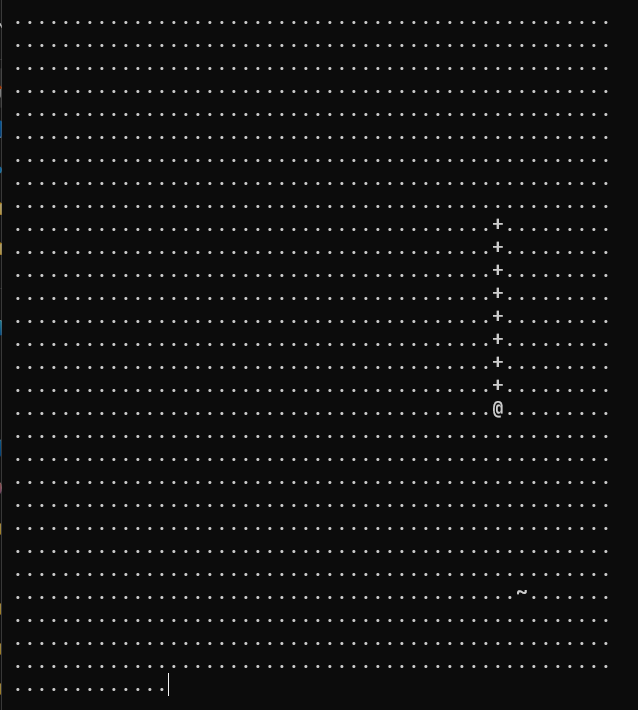

## Game Play

## How it's works
    first the game work by taking the user input 
    console gets clear and printed the new snake position
    so each frame of the game is like new output of the previous output
    output -> take input -> clear console -> print new output

## About the game 
    The game would have 2 versions
    one implemented with OOP and the other with (imperative and procedural programming paradigms)
    just to show the difference between the two and how they can be used to solve the same problem